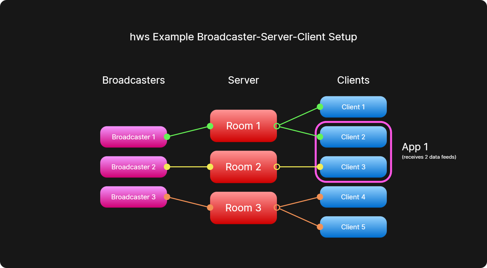

# HTTP/S WebSockets (htws)

WebSocket-like data streaming over HTTP/S with Express.js and Node.js. Supports multiple servers, broadcasters, and clients, without the WebSocket protocol.

Lightweight wrapper, HTTP chunked responses, continuous streaming, authentication, rooms.


3 main implementations:

- `htws/server` - bind `htws/server` to an Express app route to convert it into a streaming server endpoint. Accepts POST for sending and GET for streaming.
- `htws/broadcast` - broadcast text, JSON, image, buffer data to a `htws/server`.
- `htws/client` - connect to a `htws/server` stream endpoint and receive incoming data.



## Installation

Install the `htws` from NPM:

```powershell
npm install htws
```

Then, import the modules in your Node.js (Express.js for servers) project as needed.

Note that if the server is running on HTTPS, a certificate chain (whether self-signed or not) must be provided for secure connections. If a broadcaster or client is attempting to connect to an HTTPS server, they too must be provided the same certificate chain.

## Local Demo

There are ready-made demos in the [`demos`](demos) folder. To quickly test `htws`, open the following in 3 separate terminal windows:

- Start the demo server:

```powershell
node demos/server/index.js
```

- Start a client to observe the stream (choose one):

```powershell
node demos/client/local.js
node demos/client/localGIF.js
node demos/client/localImage.js
```

- Start a broadcaster (choose matching):

```powershell
node demos/broadcast/local.js
node demos/broadcast/localGIF.js
node demos/broadcast/localImage.js
node demos/broadcast/localJSON.js
```

The demos demonstrate how to run a server, broadcast binary (images/GIF) and JSON/text messages, and connect clients that parse messages automatically. You'll likely need to fine-tune these scripts so that they fit your use case and data formats.

## Usage

### server (Express.js)

The server exposes a function that returns an Express `Router`. Example usage in an Express app:

```js
const express = require('express');
const htwsRouter = require('htws/server');

const app = express();
app.use('/htws', htwsRouter({
    maxBody: '10mb',        // max POST size
    auth: true,             // require HTTP Basic auth for clients/broadcasters
    clients: ['user:pass'], // credentials format is interchangeable
    broadcasts: [{ username: 'user', password: 'pass' }]
}));

app.listen(3000, () => console.log('listening on :3000'));
```

- GET /htws (used by clients) keeps the response open and sends framed messages as they arrive.
- POST /htws (used by broadcasters) accepts a body (any content type). Bodies are queued and delivered to connected clients.
- If `auth` is enabled the server expects HTTP Basic auth. The `clients` and `broadcasts` arrays define allowed credentials. Each entry may be:
  - an object: `{ username: 'user', password: 'pass' }`
  - an array: `['user', 'pass']`
  - a string: `'user:pass'`
- The server sets `Transfer-Encoding: chunked` and uses an internal queue to handle bursts and backpressure.

### broadcaster

Use `htws/broadcast` to POST data to `htws/server`.

Example:

```js
const HTWSBroadcast = require('htws/broadcast');

const broadcaster = new HTWSBroadcast({
    server: 'http://localhost:1234/htws',
    cert: './certs/chain.pem', // optional, only needed if the server is running on HTTPS
    auth: 'user:pass',
    callback: (response => console.log('→', response)),
    close: (() => console.log('↓ stream closed')),
    error: (error => console.error(error))
});

broadcaster.send({ type: 'test', now: Date.now() });
broadcaster.send(Buffer.from([0x01, 0x02]));
broadcaster.send('plain text message');
broadcaster.stop();
```

- Emits `callback` on each confirmation message, `close` when the stream ends, and `error` on connection or parsing errors.
- If the server requires authentication, it must be provided in the `auth` option.
- If the server is running on HTTPS, the broadcaster must also be provided the same certificate chain for secure connections.
- The `send` method automatically sets a Content-Type header based on the payload (application/json for objects, text/plain for strings, application/octet-stream for Buffer).

### client

Use `htws/client` to connect to a `htws/server`'s GET endpoint and intercept a data stream.

Example:

```js
const HTWSClient = require('htws/client');

const client = new HTWSClient({
    server: 'http://localhost:1234/htws',
    cert: './certs/chain.pem', // optional, only needed if the server is running on HTTPS
    auth: 'user:pass',
    callback: (response => console.log('→', response)),
    close: (() => console.log('↓ stream closed')),
    error: (error => console.error('↓', error))
});

client.stream();
client.stop();
```

- Emits `callback` on each incoming message, `close` when the stream ends, and `error` on connection or parsing errors.
- If the server requires authentication, it must be provided in the `auth` option.
- If the server is running on HTTPS, the client must also be provided the same certificate chain for secure connections.

## HTTPS Certificates

A signed certificate chain is only required for servers running on HTTPS. The server, broadcasters, and clients must be provided the same certificate chain (whether self-signed or not) for secure connections. By default, the certificate will be loaded from the `cert` option path, defaulting to `./certs/chain.pem` if not provided.

When running the server locally, no certificate is required.

## License

`htws` licensed under ISC. (c) 2026 Faisal Nageer.
